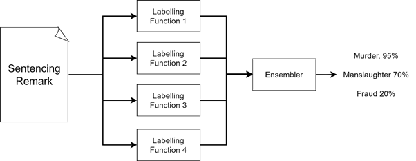
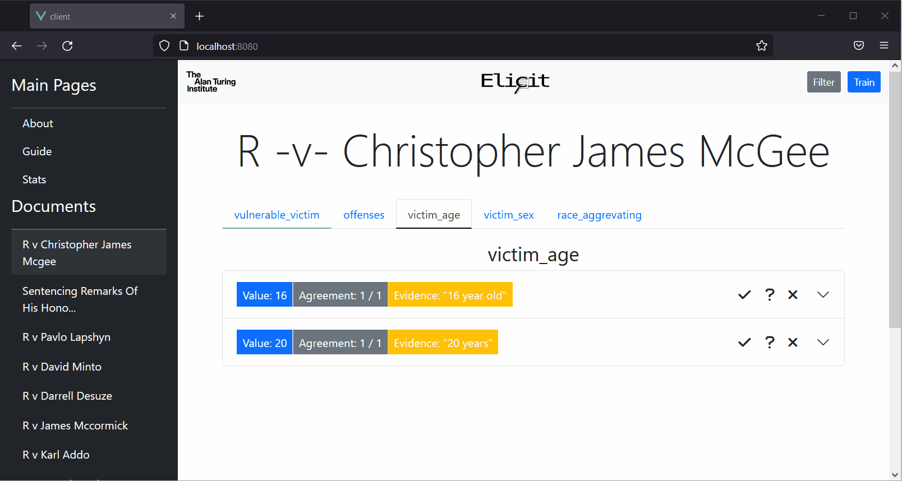

<p align="center">

</p>
<hr>

*elicit (v.) "to draw out, bring forth or to light"*

Elicit is a *human in the loop* machine learning tool for extracting information from complex documents.

The tool works in a similar manner to weak supervision approaches, such as [Snorkel](https://github.com/snorkel-team/snorkel) or [Sqweak](https://github.com/NorskRegnesentral/skweak), where the output from a set of *labelling functions* are combined to form a distribution over possible labels. 

<p align="center">

</p>

In Elicit, rather than using a generative model, the output from labelling functions are piped into a user inferface. Users then select the correct answer dependent on provided evidence.

<p align="center">

</p>

These annotations can then be exported into a tabular dataset. Rather than fully automate, our goal is to dramatically speed up the manual extraction process.


The core tenets of Elicit are:

- Reliability
- Flexibility
- Efficiency
- Privacy Preservation


## Installation

### Requirements:

- Python >= 3.9: https://docs.conda.io/en/latest/miniconda.html
- Poetry: https://python-poetry.org/
- NodeJS: https://nodejs.org/en/

Some form of GPU is **highly** reccomended.

First install all python dependencies after navigating to the codebase: `poetry install`

Following this, navigate to the user_interface/client folder and install the node dependencies: `cd user_interface/client` `npm install`

An installation process using Docker will soon be added.
## Usage

The library is currently in very early development. Syntax, features, and functionality are subject to change.

### User Interface

To run the user interface, run the bash script `./run_ui.sh`. You may need to give the script execute permission `chmod +X run_ui.sh`. Ensure you are using the appropriate python environment.

Alternatively, run the commands:
```
# Run backend python server
cd user_interface/server 
python server/app.py

# run vue frontend
cd user_interface/client
npm run serve 
```
### Defining Schemas

The existing labelling functions in Elicit have been designed to be "zero-shot". There is no training data required to get started. You therefore must define a set of schemas to 

- A set of questions to ask in order to extract the information.
- A set categories which the answer can take (alternatively "raw" or "continuous" if the answer is a string or number respectively).

Example below:

**Questions:**
```
offender_confession:
  - Did the offender confess to commiting the crime?
  - Did the offender plead guilty?
  ```
**Categories:**
```
offender_confession:
  - confession
  - no confession
  ```

**Keywords:**
```
offender_confession:
  confession:
    - confessed
    - plead guilty
    - pleaded guilty
  no confession:
    - denied
  ```

These are placed into the yaml files "categories.yml" and "questions.yml" respectively.

Basic schemas are already defined in the /schemas directory. Check the demo schemas for simple examples.

### Defining Pipelines

You can find example pipelines in elicit/example_pipelines.py.

There are two steps in creating a pipeline:
- Registering the appropriate schema (if required).
- Registering the labelling functions.

e.g.:

```
pipeline.register_schema(schema=keyword_schema, schema_name="keyword_schema")
pipeline.register_function(keyword_match)
pipeline.run(pdfs)
```

As the keyword match requires a keyword schema, the schema must be registered.

### Creating Labelling functions

Check the elicit/labelling_functions directory for existing labelling functions. 
Any labelling function must have the `@labelling_function` decorator, which can be imported from the pipline.py file.

E.g.
```
@labelling_function(labelling_method="Keyword Match", required_schemas=["keyword_schema"])
def keyword_match(pdf_text, keyword_schema):
    ...
    return case
```

If you wish to use the same function with multiple schemas, this can be done like so:

```
pipeline.register_function(keyword_match, {"keyword_schema", "keyword_schema1.yml"})
pipeline.register_function(keyword_match, {"keyword_schema", "keyword_schema2.yml"})
```
leaving the required_schemas empty.

In addition, the labelling function must return a correctly formed case object. Cases take casefields objects which contain the extracted value, confidence, and evidence. The evidence object has various classmethods to help create the evidence object, such as: `Evidence.from_character_startend`. Cases are pre-initialized by the decorator.

Below is an example of adding a field to a case, check tests/test_case.py and the existing labelling functions for more examples:
```
case.add_field("test", CaseField(value="test_value", confidence=0.5, evidence=Evidence.no_match()))
```
