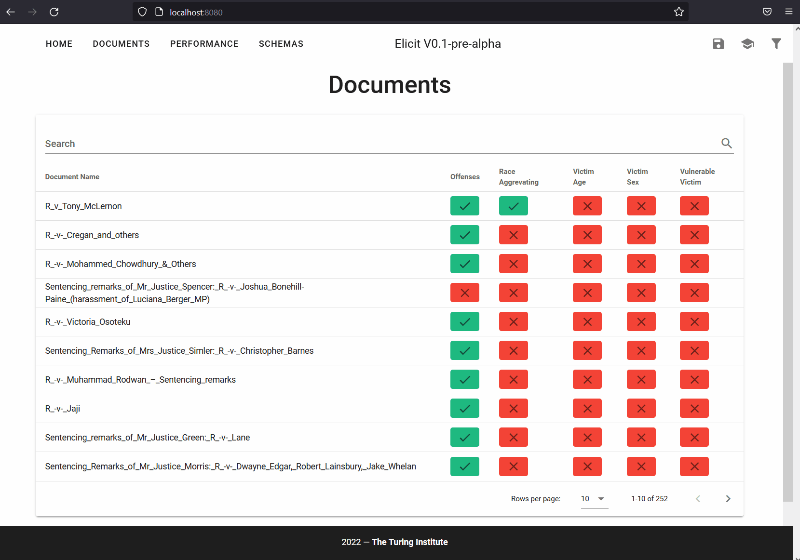

<p align="center">

</p>
<hr>

*elicit (v.) "to draw out, bring forth or to light"*

[](https://github.com/Bradley-Butcher/elicit/actions/workflows/ci.yaml)

Elicit is a *human in the loop* machine learning tool for extracting information from complex documents.

The tool works in a similar manner to weak supervision approaches, such as [Snorkel](https://github.com/snorkel-team/snorkel) or [Sqweak](https://github.com/NorskRegnesentral/skweak), where the output from a set of *labelling functions* are combined to form a distribution over possible labels. 

<p align="center">

</p>

In Elicit, rather than using a generative model, the output from labelling functions are piped into a user inferface. Users then select the correct answer dependent on provided evidence.

<p align="center">

</p>

These annotations can then be exported into a tabular dataset. Rather than fully automate, our goal is to dramatically speed up the manual extraction process.


The core tenets of Elicit are:

- Reliability
- Flexibility
- Efficiency
- Privacy Preservation


# Installation

## Requirements:

- Python >= 3.9: https://docs.conda.io/en/latest/miniconda.html
- Poetry: https://python-poetry.org/

Some form of GPU is **highly** reccomended.

Installation steps:

1. Clone the repository
2. Navigate to the repository 
3. Run `poetry install` (or `poetry install -E transformers` if you wish to use the transformer generic labelling functions)

# Usage

The library is currently in early development. Syntax, features, and functionality are subject to change.

## Extracting information from documents

You can find example pipelines in elicit/example_pipelines.py.

There are three steps in creating an extractor:
- Creating an Extrator object.
- Registering the appropriate schemas.
- Registering the labelling functions.

Example:

```
extractor = Extractor(db_path=current_dir / "test_db.sqlite") # Creates the extractor object
extractor.register_schema(schema=categories,
                            schema_name="categories") # Registers the category schema
extractor.register_schema(schema=keywords,
                            schema_name="keywords") # Registers the keyword schema
extractor.register_labelling_function(KeywordMatchLF) # Registers the KeywordMatch LF
extractor.run(docs) # Runs the extractor on the documents
launch_ui(extractor=extractor) # Launches the UI for validation
```

## User Interface

There are two options to launching the user interface:
1. The python function: `elicit.launch_ui(path_to_database | extraction_object)`
2. Using the CLI: `elicit GUI --db_path path_to_database`
## Defining Schemas

The generic labelling functions in Elicit have been designed to be "zero-shot". There is no training data required to get started. However, you must create a set of schemas that are used by the generic labelling functions.

- A set **categories** which the answer can take (alternatively "raw" or "numerical" if the answer is a string or number respectively).
- A set of **keywords** to search for in the text.
- A set of **questions** to ask in order to extract the information.


Examples below for the variable "offender_confession":

**Questions:**
```
offender_confession:
  - Did the offender confess to commiting the crime?
  - Did the offender plead guilty?
  ```
**Categories:**
```
offender_confession:
  - confession
  - no confession
  ```

**Keywords:**
```
offender_confession:
  confession:
    - confessed
    - plead guilty
    - pleaded guilty
  no confession:
    - denied
  ```

These are placed into the yaml files "categories.yml", "keywords.yml" and "questions.yml" respectively. Alternatively, they can be passed via python dictionaries.

Some schemas are already defined in the /schemas directory. Check the demo schemas for simple examples.

## Creating Labelling functions

Check the elicit/generic_labelling_functions directory for existing labelling functions. 

Labelling functions can be created by subclassing the:

- elicit.interface.CategoricalLabellingFunction for categorical variables.
- elicit.interface.NumericalLabellingFunction for numerical variables.
- elicit.interface.RawLabellingFunction for raw (i.e. plain text, such as names) variables.

Example of a Categorical Labelling Function:

```
class ExampleLabellingFunction(CategoricalLabellingFunction):
    def __init__(self, schemas, logger, **kwargs):
        super().__init__(schemas, logger, **kwargs)

    def extract(self, document_name: str, variable_name: str, document_text: str) -> None:

        kw_dicts = self.get_schema("keywords", variable_name)
        exts = []
        for k, kws in kw_dicts.items():
            for kw in kws:
                if kw in document_text:
                    exts.append(Extraction(k, kw, kw, kw, 1))
        self.push_many(
            document_name=document_name,
            variable_name=variable_name,
            extraction_list=exts)

    def train(self, document_name: str, variable_name: str, extraction: Extraction):
        pass

    def load(self) -> None:
        self.model = "test_model"

    @property
    def labelling_method(self) -> str:
        return "Test Labelling Function"
```

There are **four** required methods in a labelling function:
- `extract`: Extracts the information from the document.
- `train`: Trains the labelling function.
- `load`: Loads the models/anything required for the labelling function.
- `labelling_method`: Returns the name of the labelling function.

### Extract

Extract takes the document name, the variable name, and the document text. The user must then define how the extraction is performed, and use the `self.push`, or `self.push_many` methods to push the extracted information into the database. Access to the schemas can be gained by calling `self.get_schema(schema_name, variable_name)`.

Any extractions must be an instance of the `Extraction` class. The `Extraction` class has the following attributes:

- value (str): The value of the extraction. This will either be the category, the numerical value, or raw text; depending on the type of labelling function.
- exact_context (str): The exact context of the extraction. This is the text that was used to extract the value.
- local_context (str): The local context of the extraction. This is the text that was used to extract the value, plus some context around it. Helps the user understand the context of the extraction.
- wider_context (str): The wider context of the extraction. This is the text that was used to extract the value, plus some further context around it. This is what the user will see in a popup when the wish to see further context.
- confidence (float): The confidence of the extraction.

The contexts are ultimately the extraction methods "explanation" of the value they extract.

### Train

The train function is used to define how the labelling function learns from the human validation. The user must define how the training is performed.

### Load

This is where loading for the labelling function is performed. The user must define how the loading is performed. For transformers this is where the model is loaded.

### Labelling Method

This is simply the name of the labelling method. It is used to display the name of the labelling method in the UI.

# Further examples

We have written notebooks that further help with understanding the usage of Elicit. They can be found:

1. Basic Usage: [examples/basic_example.ipynb](examples/basic_example.ipynb)

More examples are in development.